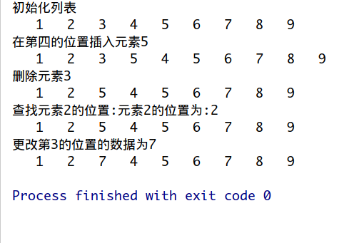

# 链表

数据结构项目,基于Clang实现单链表(也叫线性链表)

**定义**  

    逻辑结构上一个挨一个的数据,  
    在实际存储时,并没有像顺序表那样也相互紧挨着.  
    恰恰相反,数据随机分布在内存中的各个位置.  
    这种存储结构称为线性表的链式存储.

------------------------

+ 头结点：有时，在链表的第一个结点之前会额外增设一个结点，结点的数据域一般不存放数据（有些情况下也可以存放链表的长度等信息），此结点被称为头结点。
若头结点的指针域为空（NULL），表明链表是空表。头结点对于链表来说，不是必须的，在处理某些问题时，给链表添加头结点会使问题变得简单。

+ 首元结点：链表中第一个元素所在的结点，它是头结点后边的第一个结点。

+ 头指针：永远指向链表中第一个结点的位置（如果链表有头结点，头指针指向头结点；否则，头指针指向首元结点）。

+   头结点和头指针的区别：头指针是一个指针，头指针指向链表的头结点或者首元结点；头结点是一个实际存在的结点，它包含有数据域和指针域。两者在程序中的直接体现就是：头指针只声明而没有分配存储空间，头结点进行了声明并分配了一个结点的实际物理内存。
    
    
  __单链表中可以没有头结点，但是不能没有头指针__
  
## 图片
