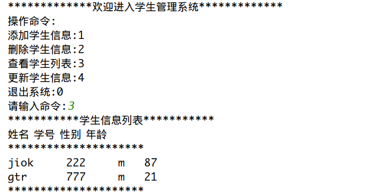
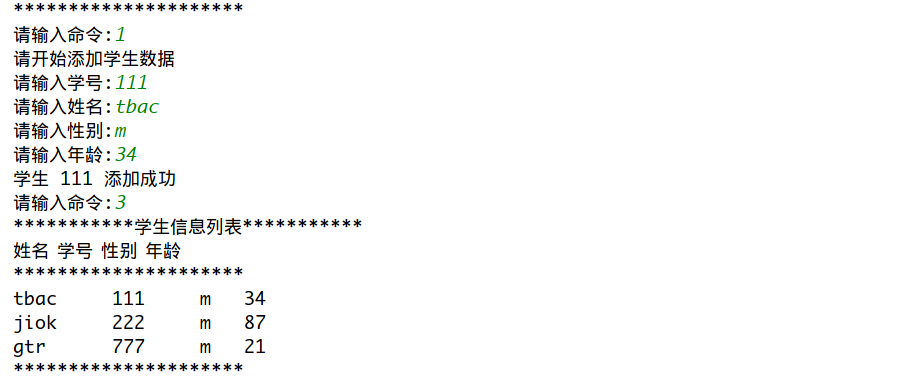
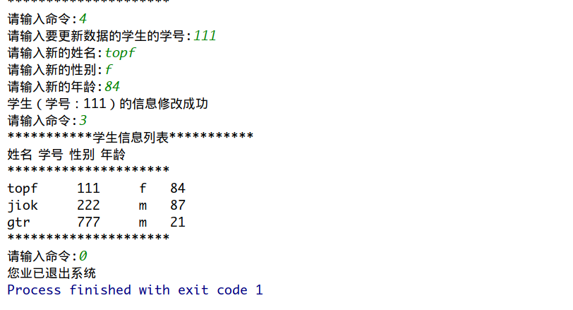

# 学生数据库管理系统

主要功能:  
- &ensp;&ensp;&ensp;&ensp;新增1名学生信息数据  

- &ensp;&ensp;&ensp;&ensp;删除一名学生的信息数据  

- &ensp;&ensp;&ensp;&ensp;修改一名学生的信息数据  

- &ensp;&ensp;&ensp;&ensp;查询全部的学生信息数据列表  

- &ensp;&ensp;&ensp;&ensp;退出系统

### 涉及知识点
+ 结构体
+ 指针
+ 文件操作
+ 块的读写
+ 链表

### 图片

