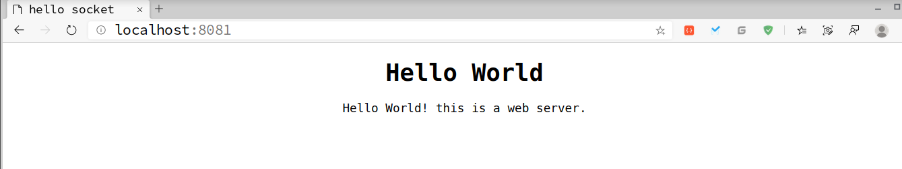

# WebServser

    使用C语言编写一个简单的小型Web服务器

----------------------------

### 所需知识
- C语言基础
- Linux编程基础
- socket编程基础(Linux)
- TCP/IP基本原理
- HTTP基本原理

----------------------------

**index.html必须与目标文件(二进制文件)处在统一文件夹下**

----------------------------

